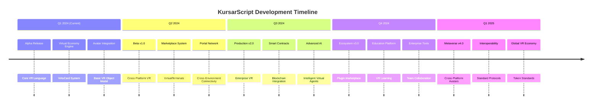

# **KursarScript (KSPL) Roadmap 2024-2025**

## 🎯 **Vision Statement**
Establish KursarScript as the premier programming language for virtual reality economies, creating a new standard for immersive digital commerce, education, and social interaction in VR environments.

---

## 📅 **Timeline Overview**

---

## 🚀 **Phase 1: Core Foundation (Q1 2024)**
**Status: Alpha Development** 🚧

### **Alpha 1.0 - Virtual Economy Engine** (March 2024)
- [x] **Core Language Features**
  - [x] Basic interpreter with object-oriented design
  - [x] Class system without inheritance (VR-optimized)
  - [x] Virtual environment runtime
  - [x] Avatar and entity management

- [x] **Virtual Economy Primitives**
  - [x] VirtuCard digital currency system
  - [x] VirtualTerminal marketplace hubs
  - [x] Basic transaction processing
  - [x] Inventory management system

- [x] **Development Tools**
  - [x] Command-line interface (CLI)
  - [x] Interactive REPL for VR prototyping
  - [x] Basic documentation and examples
  - [x] Mock VR environment simulator

### **Alpha 1.1 - Enhanced VR Integration** (April 2024)
- [ ] **VR Environment Support**
  - [ ] Unity3D plugin bridge
  - [ ] Unreal Engine integration
  - [ ] WebXR browser compatibility
  - [ ] Desktop VR simulation mode

- [ ] **Advanced Economy Features**
  - [ ] VirtualPortals for cross-environment connectivity
  - [ ] Dynamic pricing algorithms
  - [ ] Supply and demand simulation
  - [ ] Auction and bidding systems

- [ ] **Avatar Enhancement**
  - [ ] Custom avatar attributes and skills
  - [ ] Inventory weight/space management
  - [ ] Avatar-to-avatar interaction protocols
  - [ ] Social reputation system

---

## 🔥 **Phase 2: Ecosystem Expansion (Q2 2024)**

### **Beta 2.0 - Cross-Platform VR** (June 2024)
- [ ] **Platform Integration**
  - [ ] Oculus/Meta Quest native support
  - [ ] HTC Vive/Valve Index compatibility
  - [ ] PlayStation VR2 integration
  - [ ] Mobile VR (Android/iOS)

- [ ] **Advanced Marketplace Features**
  - [ ] 3D product visualization
  - [ ] Virtual try-on systems
  - [ ] Automated vendor bots
  - [ ] Cross-environment shipping

- [ ] **Developer Ecosystem**
  - [ ] VS Code extension with VR preview
  - [ ] Unity/Unreal editor plugins
  - [ ] Debugger with VR spatial debugging
  - [ ] Performance profiling tools

### **Beta 2.1 - Social & Educational VR** (August 2024)
- [ ] **Social Features**
  - [ ] Voice chat integration
  - [ ] Gesture and emotion systems
  - [ ] Virtual event hosting
  - [ ] Group formation and management

- [ ] **Educational Platform**
  - [ ] Virtual classrooms
  - [ ] Interactive training simulations
  - [ ] Skill certification in VR
  - [ ] Educational content marketplace

- [ ] **Security & Privacy**
  - [ ] End-to-end encrypted transactions
  - [ ] Avatar privacy controls
  - [ ] Content moderation tools
  - [ ] Age verification system

---

## ⚡ **Phase 3: Production & Scale (Q3 2024)**

### **v3.0.0 - Enterprise VR** (September 2024)
- [ ] **Enterprise Features**
  - [ ] Multi-user virtual offices
  - [ ] VR conference and meeting systems
  - [ ] Corporate training platforms
  - [ ] Virtual trade shows and exhibitions

- [ ] **Advanced Economy Features**
  - [ ] Smart contracts for VR agreements
  - [ ] Escrow systems for high-value transactions
  - [ ] Virtual real estate management
  - [ ] Intellectual property protection

- [ ] **Performance & Scale**
  - [ ] 1000+ concurrent avatar support
  - [ ] Distributed VR environment hosting
  - [ ] Load-balanced marketplace servers
  - [ ] Real-time synchronization engine

### **v3.1.0 - Blockchain Integration** (November 2024)
- [ ] **Web3 Integration**
  - [ ] NFT support for virtual items
  - [ ] Cryptocurrency wallet integration
  - [ ] Decentralized marketplace protocols
  - [ ] Blockchain-based identity verification

- [ ] **Interoperability Standards**
  - [ ] OpenXR extended for economy
  - [ ] VRML extensions for commerce
  - [ ] GLTF/glTF extensions for items
  - [ ] Metaverse interoperability protocols

- [ ] **Advanced AI Features**
  - [ ] Intelligent virtual assistants
  - [ ] AI-powered customer service bots
  - [ ] Predictive market analysis
  - [ ] Automated content generation

---

## 🚀 **Phase 4: Metaverse Ecosystem (Q4 2024 - Q1 2025)**

### **v4.0.0 - Metaverse Platform** (December 2024)
- [ ] **Cross-Platform Metaverse**
  - [ ] Persistent virtual worlds
  - [ ] Cross-VR-platform avatar portability
  - [ ] Universal item standards
  - [ ] Metaverse-wide search and discovery

- [ ] **Content Creation Tools**
  - [ ] Visual scripting interface
  - [ ] 3D model import and optimization
  - [ ] Interactive content builder
  - [ ] Template marketplace for developers

- [ ] **Economic Systems**
  - [ ] Virtual stock markets
  - [ ] Banking and loan systems in VR
  - [ ] Insurance for virtual assets
  - [ ] Taxation and regulatory compliance tools

### **v5.0.0 - Global VR Economy** (March 2025)
- [ ] **Global Standards**
  - [ ] KSPL standardization body
  - [ ] International VR commerce regulations
  - [ ] Cross-border transaction protocols
  - [ ] Multi-currency support and exchange

- [ ] **Education & Certification**
  - [ ] VR development certification programs
  - [ ] University partnerships for VR curriculum
  - [ ] Professional VR economist certification
  - [ ] Global VR skills marketplace

- [ ] **Research & Innovation**
  - [ ] VR economy research institute
  - [ ] Open source VR commerce protocols
  - [ ] Interdisciplinary research partnerships
  - [ ] Annual VR Economy Summit

---

## 🎯 **Stretch Goals**

### **Advanced Technologies**
- [ ] **Haptic Integration**
  - Full-body haptic suit compatibility
  - Force feedback for virtual objects
  - Temperature simulation in transactions
  - Texture and material haptics

- [ ] **Neural Interface**
  - Brain-computer interface (BCI) prototypes
  - Thought-driven commerce interfaces
  - Neural transaction verification
  - Cognitive load optimization

- [ ] **Quantum-Resistant Security**
  - Post-quantum cryptography for VR
  - Quantum key distribution for high-value assets
  - Quantum-safe smart contracts
  - Quantum random number generation

### **Industry-Specific Solutions**
- [ ] **Virtual Healthcare Economy**
  - Telemedicine in VR
  - Virtual medical training simulations
  - Healthcare marketplace in VR
  - Medical equipment virtual showrooms

- [ ] **Virtual Real Estate**
  - Virtual land development tools
  - VR architectural visualization
  - Virtual property management
  - Cross-reality property bridges

- [ ] **Entertainment & Media**
  - Virtual concert economies
  - VR film production and distribution
  - Interactive storytelling platforms
  - Virtual sports and competitions

---

## 🔧 **Technical Debt & Maintenance**

### **Code Quality**
- [ ] 95%+ test coverage for core systems
- [ ] Comprehensive VR hardware compatibility testing
- [ ] Security penetration testing
- [ ] Accessibility compliance (WCAG for VR)

### **Documentation & Education**
- [ ] Interactive VR tutorials
- [ ] Developer certification program
- [ ] University textbook and curriculum
- [ ] Multilingual documentation

### **Community Building**
- [ ] Global VR developer meetups
- [ ] Annual VR Economy Conference
- [ ] Contributor mentorship program
- [ ] Open source research grants

---

## 🌟 **Success Metrics**

### **Adoption Metrics**
- **Q1 2024**: 100+ active developers in alpha
- **Q2 2024**: 50+ VR applications using KSPL
- **Q3 2024**: 10,000+ monthly active VR users
- **Q4 2024**: 500+ companies using for training
- **Q1 2025**: 1,000,000+ virtual transactions processed

### **Economic Metrics**
- **Virtual GDP**: Track total economic activity in KSPL-powered VR
- **Transaction Volume**: Monthly value of virtual transactions
- **Marketplace Growth**: Number of active VirtualTerminals
- **Developer Economy**: Revenue generated by KSPL developers

### **Technical Metrics**
- **Performance**: Support 10,000 concurrent avatars
- **Latency**: <50ms transaction processing
- **Uptime**: 99.99% for critical systems
- **Security**: Zero critical vulnerabilities in production

### **Community Metrics**
- **Contributors**: 500+ active contributors
- **Educational Impact**: 100+ universities teaching KSPL
- **Standards Influence**: 5+ official VR standards contributions
- **Research Output**: 50+ academic papers citing KSPL

---

## 🤝 **How to Contribute**

### **Development Streams**
1. **Core Language**: Parser, interpreter, runtime improvements
2. **VR Integration**: Unity/Unreal plugins, hardware support
3. **Economy Engine**: Transaction systems, marketplace features
4. **Security**: Cryptography, privacy, compliance
5. **Tooling**: IDE extensions, debuggers, profilers
6. **Documentation**: Tutorials, API docs, research papers
7. **Education**: Curriculum development, teaching materials

### **Contribution Pathways**
- **VR Enthusiasts**: Test in actual VR environments
- **Economists**: Design virtual economic systems
- **Educators**: Create learning materials and courses
- **Researchers**: Study VR economy patterns and behaviors
- **Developers**: Build applications and extensions
- **Artists**: Create virtual items and environments

### **Governance Model**
- **VR Economy Council**: Representatives from major platforms
- **Technical Committee**: Language and protocol development
- **Standards Body**: Interoperability and compliance
- **Community Assembly**: User and developer representation

---

## 📞 **Stay Updated**

### **Official Channels**
- **GitHub**: Main development and RFC process
- **Discord**: VR developer community and support
- **VirtualHQ**: Monthly VR meetups in KursarScript-powered environment
- **Research Journal**: Academic papers and case studies
- **VR Newsletter**: Industry insights and development updates

### **Events & Conferences**
- **Monthly**: VR Developer Workshops (virtual)
- **Quarterly**: VR Economy Summit (hybrid virtual/physical)
- **Annual**: International VR Commerce Conference
- **Ongoing**: University hackathons and competitions

### **Release Schedule**
- **Weekly**: Development builds for testing
- **Monthly**: Feature releases and improvements
- **Quarterly**: Major version releases
- **Annual**: Ecosystem and platform releases

---

## 📄 **License & Philosophy**

KursarScript is **Dual Licensed**:
- **Core Language**: MIT License for education and research
- **Enterprise Extensions**: Commercial license for large deployments
- **Protocols**: Open standard with royalty-free implementation

**Philosophy**: We believe in creating an open, accessible virtual economy that empowers users, protects privacy, and fosters innovation while ensuring sustainability through responsible governance.

**Governance Principle**: Distributed governance with representation from users, developers, researchers, and platform providers to ensure balanced development.

---

## 🌍 **Impact Goals**

### **By 2025**
- Enable 1 million people to earn income through virtual economies
- Train 100,000 developers in VR programming
- Process $100M in legitimate virtual commerce
- Establish 10 international VR economy research centers

### **By 2030**
- Create the standard protocol for metaverse economies
- Enable sustainable virtual nations with their own economies
- Bridge 50% of real-world small businesses to virtual presence
- Democratize global economic participation through VR

---

**✨ KursarScript: Building Economies in Virtual Reality, Empowering People in Reality.** 🚀

*"We're not just creating a programming language; we're architecting the economic foundations of the metaverse."*

*Last Updated: January 2024*
*Next Review: Quarterly with community feedback*
